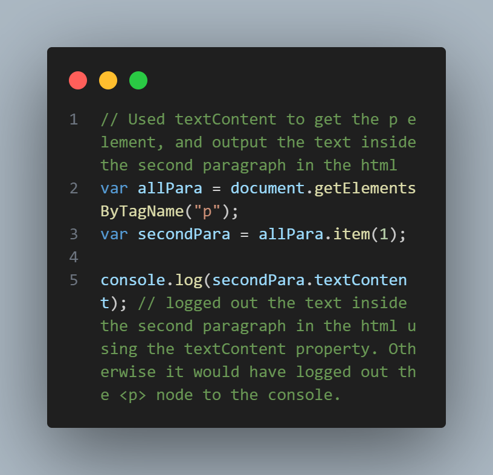

# Learning JavaScript in Public

## The goal is to be an above average JavaScript Developer

This is a resource file of me learning JavaScript and holding myself accountable.

Feel free to browse through the code to see how much I am learning and what I am learning daily. Thanks!

## My Plan to learn JavaScript, and go from beginner to Master

- Watch Net Ninja JavaScript course on Youtube and Udemy.
- Take more courses on JavaScript basics.
- Watch youtube videos, read documentations, and listen to the "All things HTML podcast about JavaScript".
- Watch all videos and study materials from my Coding Bootcamp with the Uni of Birmingham.

## Code Screenshots of concepts I am learning

- Using textContent to access and modify elements in the DOM

  

*

## Deadline to become an above average JavaScript coder

- October 1st 2023.
